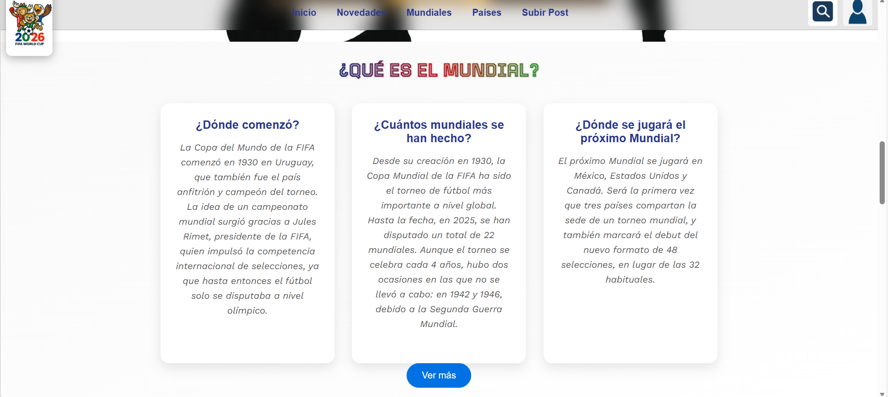
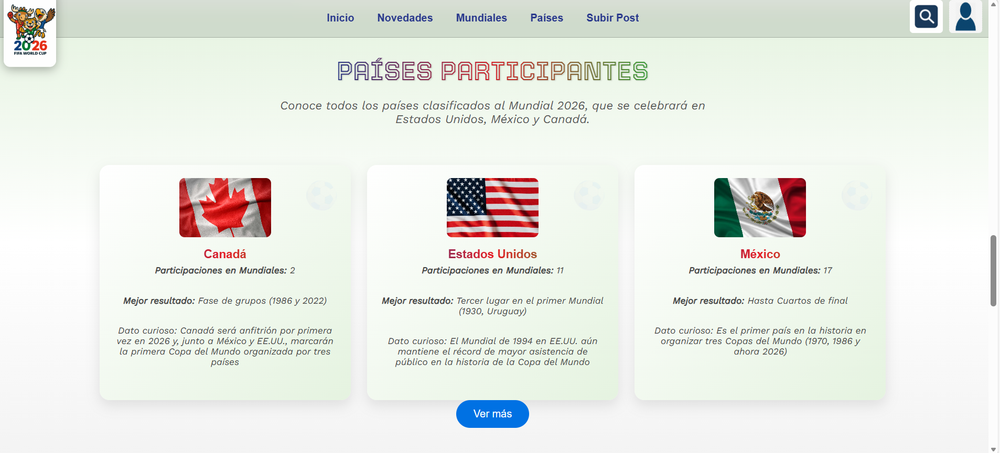
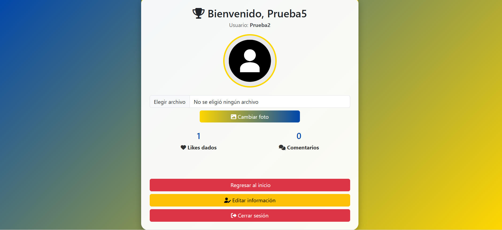

# ⚽ Red Social del Mundial

Plataforma web tipo red social desarrollada con PHP y MySQL, inspirada en la interacción de aficionados durante un mundial de fútbol.

Permite a los usuarios registrarse, publicar contenido, interactuar mediante comentarios, agregar amigos y dar "likes" a publicaciones.

---

## Funcionalidades Principales

-  Registro e inicio de sesión
-  Actualizar Informacion del perfil de usuario
-  Publicación de posts con imágenes
-  Sistema de likes
-  Comentarios en publicaciones
-  Gestión de archivos multimedia
-  Organización por usuarios
-  Procedimientos almacenados para gestión de datos
-  Mostrar cuantas interraciones han tenido los usuarios Likes y comentarios

---

## Tecnologías Utilizadas

- PHP
- MySQL
- phpMyAdmin
- HTML5
- CSS3
- JavaScript
- Bootstrap

---

## Base de Datos

La base de datos fue diseñada bajo modelo relacional e incluye tablas como:

- Usuario
- Publicacion
- Comentario
- Amigos
- Likes
- Multimedia

Se implementaron procedimientos almacenados para optimizar operaciones CRUD y mejorar la organización del backend.

---

##  Capturas del Sistema

### Página de Inicio

  
  

  
  

### Publicaciones con Post y Comentarios

  
  

### Perfil de Usuario

  
  

### Video de barras de Busqueda

---

## ⚙️ Instalación

1. Clonar el repositorio
2. Importar la base de datos en phpMyAdmin
3. Configurar archivo de conexión
4. Ejecutar en XAMPP

---

## 🎯 Objetivo del Proyecto

Simular el comportamiento de una red social enfocada en eventos deportivos masivos, aplicando conceptos de bases de datos, relaciones entre entidades y lógica backend en PHP.

---

## 👨‍💻 Autor

Uriel Almaguer Arias
